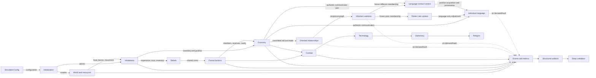

# Architecture overview

Thalren Vale is a single-process, layer-ordered simulation with a partially centralized runtime container. `SimulationState` owns the principal mutable collections, while older domain modules retain aliases to those collections and additional module globals. `sim.py` coordinates lifecycle and cross-layer ordering; domain behavior remains in the owning modules.

## Architectural shape

Solid arrows indicate configuration, state reads, or causal mutation. Dotted arrows indicate internal observability without standard metrics columns.

## State model

`SimulationState` directly owns living/dead populations, formal factions, event history, war/diplomacy/economy/religion stores, the stable-ID allocator, informal-coalition runtime, language runtime, dialect runtime, and language-contact runtime. World tiles and several legacy caches remain module-owned. Reset clears core stores in place so imported aliases keep their identity.

This is not an event-sourced architecture. Events observe changes; they are not the authoritative state and cannot replay a run. The run manifest holds provenance and a final selected-state fingerprint, not a checkpoint.

## Execution model

- Explicit-seed runs use serial inhabitant processing.
- Unseeded runs may use up to four Layer-1 worker threads.
- Other layers execute sequentially on the main thread.
- A `StructuredEventLog` journals events in production order.
- End-of-tick observation happens after all causal layers and emergent maintenance.
- The manifest is the last required publication step.

See [tick lifecycle](tick-lifecycle.md) for the exact order.

## Two social structures

Formal factions and informal coalitions are intentionally separate:

| Property | Formal faction | Informal coalition |
| --- | --- | --- |
| Identity | Generated mutable name | Monotonic integer ID |
| Input | Beliefs, legacy name-keyed trust, proximity | Reciprocal stable-ID `Relationship` topology |
| Default | Enabled unless layer disabled | Disabled by default |
| RNG | Yes | No |
| Effects | Economy, combat, technology, diplomacy, religion, movement | Descriptive; optionally changes language rates only |
| Membership storage | `Faction.members` plus `Inhabitant.faction` | Validated member-ID tuples and lookup map |

An inhabitant can belong to one of each; neither membership derives from the other.

## Isolation boundaries

- Metrics, event observation, hashing, dialect/contact summaries, and artifact validation consume no simulation RNG.
- Language interpretation cannot change transfer success or any biological, economic, faction, coalition, combat, or movement outcome.
- Informal coalitions do not own resources, territory, policy, vocabulary, or official languages.
- Coalition Dialects v1 is one-way: prior committed membership can change learning rates; language never changes coalition lifecycle.
- Language Contact v1 is also one-way: only authentic
  different-active-coalitions communication can strengthen positive receiver
  acquisition and record borrowing provenance. Assigned/unassigned
  communication stays at base rates.
- Plugins are an exception to the observer pattern: their bridge is immutable, but accepted commands causally spawn inhabitants or adjust resources, and plugin Python is not sandboxed.
- Mythology is a disabled-by-default narrative observer with external I/O; its prose is not fed back into the simulation.

## Transaction boundaries

Focused transactions exist for:

- stable inhabitant admission across ID, grid, population, and optional membership;
- informal-coalition transitions, which propose and fully validate a new runtime;
- language communication across sender/receiver language state and
  language/dialect/contact runtimes.

The complete tick and economy-to-language chain are not atomic. A committed transfer precedes optional relationship and language hooks; a later hook exception does not roll back the transfer.

## Implementation evidence

- Orchestration: `src/thalren_vale/sim.py`.
- State ownership: `src/thalren_vale/state.py` and module aliases near the top of `sim.py`.
- Reset: `sim.reset_runtime_state`, `SimulationState.reset`.
- Isolation tests: `tests/test_language_interaction_hooks.py`,
  `tests/test_coalition_dialects.py`, `tests/test_language_contact.py`,
  `tests/test_social_partner_choice.py`.
- Lifecycle tests: `tests/test_run_termination.py`, `tests/test_simulation_state.py`.
