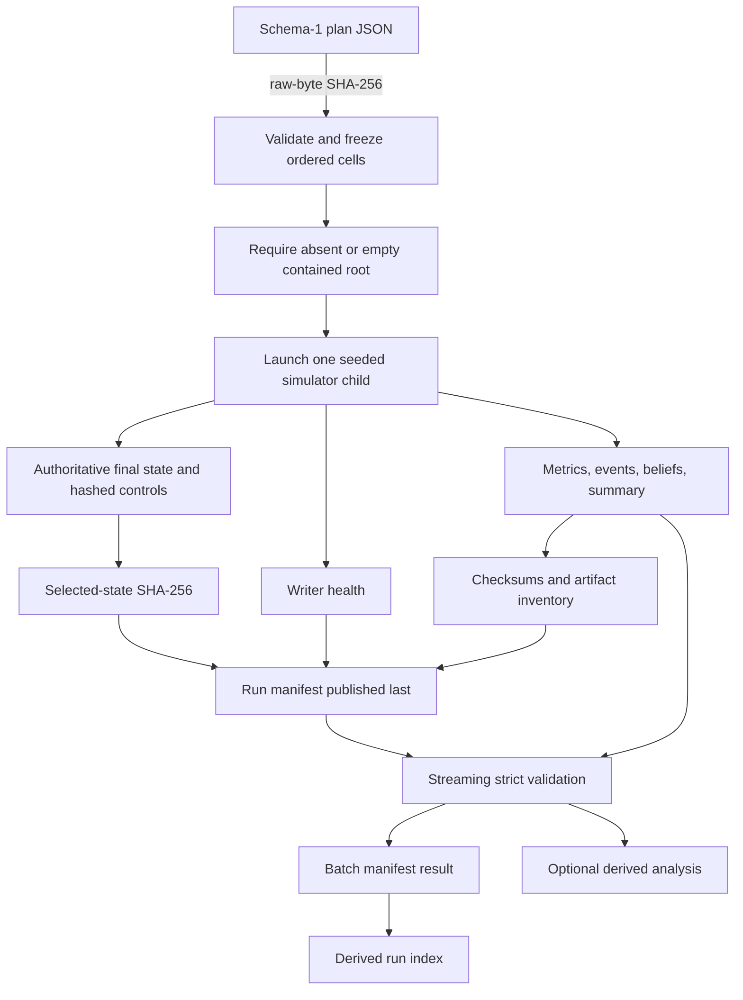

# Experiment and artifact flow

Current limitations: no immutable attempt directory, append-only ledger, selected attempt, safe nonempty-root resume, fail-fast dispatch, environment/plugin preflight, or V2-ready execution contract. All are **Planned, not implemented**.
