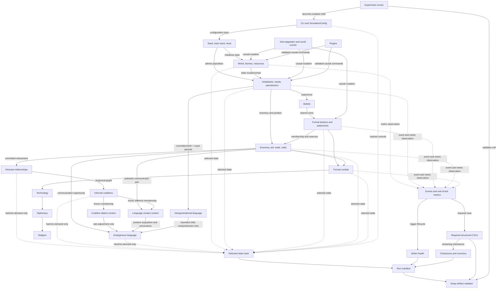

# Full system map

## Edge interpretation

- Solid labeled edges show configuration or causal state flow.
- Dotted edges show observation without intended feedback.
- The selected-state hash is computed directly from authoritative state and
  hashed controls; required CSV contents do not produce it.
- The `COAL -> DIALECT -> LANG` and `COAL/ECON -> CONTACT -> LANG` paths are
  one-way; no language-to-coalition, social, or material edge exists.
- The `AGENT -> INTERGEN -> LANG` path begins only after successful child
  admission. It has no reverse edge into reproduction, population, health,
  resources, factions, or relationships.
- Plugins are causal even though their advertised bridge snapshots are immutable.

See [architecture overview](../architecture/architecture-overview.md) and [system dependency map](../architecture/system-dependency-map.md).
