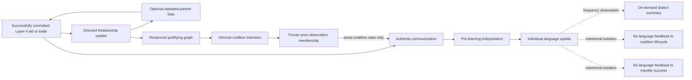

# Social and language causal chains

The dotted isolation edges document that vocabulary and interpretation do not
affect coalition lifecycle or transfer success. Layer-1 swaps, raids,
proximity alone, timers, and maintenance passes do not create authentic
language communication.
