# Social and language causal chains

```mermaid
flowchart LR
    TRANSFER[Successfully committed Layer-4 aid or trade]
    REL[Directed Relationship update]
    BIAS[Optional repeated-partner bias]
    GRAPH[Reciprocal qualifying graph]
    COAL[Informal coalition transition]
    SNAP[Frozen prior-observation membership]
    CLASS[Shared coalition communication context]
    COMM[Authentic communication]
    SOURCE{Pre-existing usable production?}
    OPPORTUNITY[At most one deterministic lexical opportunity]
    EMIT[Exact source or one-token descendant emitted]
    BASE[Ordinary invention or no signal]
    INTERP[Pre-learning interpretation]
    UPDATE[Individual language update]
    ACQUIRE[Stronger positive receiver acquisition]
    EXPOSURE[Bounded cross-boundary exposure]
    BORROW[Contact-qualified borrowing promotion]
    MIXED[Mixed individual vocabulary]
    SUMMARY[On-demand dialect/contact/intergenerational/lexical summaries]
    NOCOAL[No language feedback to coalition lifecycle]
    NOTRANSFER[No language feedback to transfer success]
    BIRTH[Successfully committed birth]
    PARENTS[Exact parents in stable-ID order]
    VERTICAL[Bounded usable parental forms]
    CHILD[Child comprehension only]
    LATER[Ordinary later reinforcement, forgetting, pruning, or promotion]
    NOBIRTH[No language feedback to reproduction]

    TRANSFER --> REL
    REL --> BIAS
    BIAS --> TRANSFER
    REL --> GRAPH
    GRAPH --> COAL
    COAL --> SNAP
    SNAP --> CLASS
    TRANSFER --> COMM
    CLASS -->|same coalition: optional dialect rates| COMM
    COMM --> SOURCE
    SOURCE -->|yes| OPPORTUNITY
    SOURCE -->|no| BASE
    OPPORTUNITY --> EMIT
    EMIT --> INTERP
    BASE --> INTERP
    INTERP --> UPDATE
    CLASS -->|different active coalitions only| ACQUIRE
    INTERP --> ACQUIRE
    ACQUIRE --> EXPOSURE
    EXPOSURE --> BORROW
    BORROW --> MIXED
    UPDATE -. frequency observation .-> SUMMARY
    MIXED -. contact observation .-> SUMMARY

    UPDATE -. intentional isolation .-> NOCOAL
    UPDATE -. intentional isolation .-> NOTRANSFER
    BIRTH --> PARENTS
    PARENTS --> VERTICAL
    VERTICAL --> CHILD
    CHILD --> LATER
    CHILD -. retention observation .-> SUMMARY
    CHILD -. intentional isolation .-> NOBIRTH
```

The dotted isolation edges document that vocabulary and interpretation do not
affect coalition lifecycle or transfer success. Layer-1 swaps, raids,
proximity alone, timers, and maintenance passes do not create authentic
language communication. Assigned/unassigned and both-unassigned communication
do not enter the contact chain; they retain base Language v1 behavior.
The birth chain begins only after `_spawn(child)` commits and creates
comprehension, never birth-time production. Parents remain read-only, non-birth
spawns do not enter the chain, and no genealogy or recurring teaching loop is
present. The lexical opportunity follows only a pre-existing usable production
form. It uses no RNG or coalition/dialect/contact derivation input, and any
descendant is the one actual signal interpreted by the receiver. The already
committed transfer is not rolled back by a later language failure.
