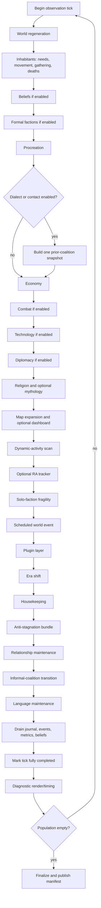

# Tick flow

```mermaid
flowchart TD
    START[Begin observation tick] --> WORLD[World regeneration]
    WORLD --> INH[Inhabitants: needs, movement, gathering, deaths]
    INH --> BEL[Beliefs if enabled]
    BEL --> FAC[Formal factions if enabled]
    FAC --> BIRTH[Procreation]
    BIRTH --> SNAP{Dialect or contact enabled?}
    SNAP -->|yes| FROZEN[Build one prior-coalition snapshot]
    SNAP -->|no| ECO[Economy]
    FROZEN --> ECO
    ECO --> COMBAT[Combat if enabled]
    COMBAT --> TECH[Technology if enabled]
    TECH --> DIP[Diplomacy if enabled]
    DIP --> REL[Religion and optional mythology]
    REL --> MAP[Map expansion and optional dashboard]
    MAP --> DYN[Dynamic-activity scan]
    DYN --> RA[Optional RA tracker]
    RA --> SOLO[Solo-faction fragility]
    SOLO --> EVENT[Scheduled world event]
    EVENT --> PLUGIN[Plugin layer]
    PLUGIN --> ERA[Era shift]
    ERA --> HOUSE[Housekeeping]
    HOUSE --> ANTI[Anti-stagnation bundle]
    ANTI --> SOCIAL[Relationship maintenance]
    SOCIAL --> COAL[Informal-coalition transition]
    COAL --> LANG[Language maintenance]
    LANG --> OBS[Drain journal, events, metrics, beliefs]
    OBS --> COMPLETE[Mark tick fully completed]
    COMPLETE --> DIAG[Diagnostic render/timing]
    DIAG --> EXTINCT{Population empty?}
    EXTINCT -->|no| START
    EXTINCT -->|yes| FINAL[Finalize and publish manifest]
```

Conditional stages remain in their displayed positions when disabled. See [exact tick lifecycle](../architecture/tick-lifecycle.md) for cadence and timing consequences.
