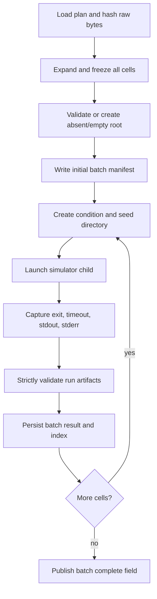

# Run Lifecycle and Artifact Validation

## Overview

The current system has two nested lifecycles:

1. a batch runner owns a fresh output root and child process sequence;
2. each simulator child owns its state, required writers, termination record,
   final state hash, and run manifest.

Deep validation checks a completed artifact set independently of process exit.
Validation success and V2 research readiness are separate decisions.

## Lifecycle



The current `N -- yes` edge is unconditional: a failed or invalid cell does not
stop later dispatch. Stop-on-first-nonaccepted behavior is **Planned, not
implemented**.

## Simulator termination contract

The simulator records:

- `requested_ticks`;
- `final_tick`, the last fully completed tick;
- `completed_ticks`, currently equal to `final_tick`;
- `termination_reason`;
- `result_status`;
- `completed_normally`;
- structured writer health and finalization diagnostics.

Accepted strict completion states are:

| Terminal state | Required relationship |
| --- | --- |
| Requested horizon | `result_status == "completed"`, `completed_normally is true`, `termination_reason == "requested_ticks_reached"`, and `final_tick == requested_ticks`. |
| Registered extinction | Same completion flags, `termination_reason == "extinction"`, `final_tick < requested_ticks`, and final metrics population zero. |

The default natural-terminal allowlist contains only `extinction`. A
KeyboardInterrupt produces `user_cancelled`/`cancelled`; another exception or
required finalization failure produces `exception`/`failed`. Strict validation
rejects those as noncompleted evidence even if a manifest was sealed.

Required structured writers are finalized and closed before the state hash is
computed. Optional reports and narratives run afterward and cannot convert a
required-output failure into success. The per-run manifest is the final
explicit publication step and is written through a temporary file followed by
`os.replace`.

## Validation modes

| Mode | Accepted manifest schema | Depth | Readiness meaning |
| --- | --- | --- | --- |
| `strict` | schema 2 only | Full termination, artifact, inventory, writer-health, configuration, and cross-file checks | May be valid without being V2-ready. |
| `auto` | schema 1 or 2 | Selects legacy or strict path from manifest schema | Default CLI mode; preserves explicit legacy reads. |
| `legacy` | schema 1 only | Headers, basic identity/tick checks, nonempty metrics, matching summary | Never V2-ready. |

Strict validation streams CSV rows and hashes files in chunks. Diagnostic issue
storage is bounded to three representative rows/messages per artifact/code,
with counts for suppressed repetitions.

## Strict artifact checks

Strict validation requires contained, ordinary, nonsymlinked files and checks:

- exact CSV headers and artifact schema versions;
- manifest condition, seed, state-hash shape, requested horizon, and timing
  contract;
- contiguous metrics ticks beginning at 1 and ending at `final_tick`;
- numeric domains and nondecreasing cumulative metrics;
- event schema/type, nondecreasing ticks, technology identifiers, and explicit
  zero-event policy;
- belief cadence, no duplicate identity within a snapshot, and one row per
  living inhabitant at required cadence ticks;
- exactly one strict run-summary row;
- summary agreement with final/aggregate metrics and event counts;
- writer-health accounting, no unresolved required failures, no pending event
  rows, and finalized/closed writers;
- inventory basename, size, SHA-256, row count, and schema agreement;
- no artifact row beyond `final_tick`.

The validator does not recompute the canonical simulation state hash from CSV
artifacts; it validates that the manifest contains a lowercase SHA-256 value.
Recomputing the hash requires authoritative final state, which the CSVs do not
contain.

## Validity versus V2 readiness

A schema-2 run is `valid` when ordinary strict checks pass. It is `v2_ready`
only when all readiness checks also pass. Readiness requires a complete
external `ExpectedRunContract` matching:

- seed, condition, requested ticks, and log mode;
- anti-stagnation, disabled-layer, combat, and raid policy;
- execution mode;
- plan identity and SHA-256;
- code commit, nonempty tag, and `code_dirty: false`;
- environment fingerprint;
- zero-event and belief-snapshot policy.

The current runner calls strict validation without this contract. Current
simulator manifests also omit plan identity/hash, code tag, and environment
fingerprint. Consequently current real runner output is at most
`schema2_valid`, not `v2_ready`.

Readiness additionally vetoes nondefault social-memory, coalition, language,
and dialect controls. Missing historical controls may remain valid but cannot
become ready; malformed or contradictory present fields make the artifact
invalid.

## Batch result persistence

After each child returns and validation finishes, the runner appends the result
to its in-memory list and rewrites root metadata. A result includes condition,
seed, status, elapsed time, return code, state hash when readable, relative run
directory, command, validation errors, and readiness Boolean.

Current limitations matter during failures:

- there is no attempt ID or immutable attempt directory;
- the root manifest is mutable current batch state, not an append-only ledger;
- a runner/layout exception before result append can leave an unrecorded
  partial cell;
- timeout evidence remains in the cell directory but is normally invalid;
- no failed, timed-out, cancelled, or invalid cell can be resumed in place;
- later cells still dispatch after ordinary failed results.

## Identifying incomplete, failed, stale, and superseded results

- **Incomplete/failed:** strict validation returns `invalid`; inspect manifest
  status, final tick, writer health, and validation errors.
- **Timed out/cancelled:** batch result uses the explicit runner classification;
  any partial run artifacts remain audit diagnostics, not final endpoints.
- **Stale:** current CLI cannot prove freshness against current plan/commit/tag/
  environment because it supplies no external contract. Programmatic contract
  mismatch yields readiness errors.
- **Superseded:** no authoritative current implementation exists. The declared
  result constant and historical derived tables do not establish a selection
  ledger.

See [Identifying valid runs](../data/identifying-valid-runs.md) for an operator
checklist.

## Safe verification command

```bash
python run_experiments.py \
  --plan /absolute/path/to/plan.json \
  --output-dir /absolute/path/to/existing-root \
  --verify \
  --validation-mode strict
```

With `--plan`, verification launches no child and does not create an absent
root. Exit zero means expected cells were valid under the selected mode, not
that they were V2-ready.

## Research-readiness boundary

Core Replication V2 has not been executed. Immutable attempts, fail-fast
dispatch, selection/supersession, clean-tag/environment/plugin preflight,
contract-safe resume, quotas, nonexecuting matrix expansion, and frozen V2
conditions remain **Planned, not implemented**. No current output should be
described as V2 research evidence.

## Implementation evidence

- Source: [`run_experiments.py`](../../../run_experiments.py),
  [`src/thalren_vale/artifact_validation.py`](../../../src/thalren_vale/artifact_validation.py),
  [`src/thalren_vale/artifact_contract.py`](../../../src/thalren_vale/artifact_contract.py),
  [`src/thalren_vale/reproducibility.py`](../../../src/thalren_vale/reproducibility.py),
  [`src/thalren_vale/sim.py`](../../../src/thalren_vale/sim.py)
- Tests: [`tests/test_artifact_validation.py`](../../../tests/test_artifact_validation.py),
  [`tests/test_run_termination.py`](../../../tests/test_run_termination.py),
  [`tests/test_experiment_runner.py`](../../../tests/test_experiment_runner.py)
- Draft plan: [`CORE_REPLICATION_V2_PLAN.md`](../../../CORE_REPLICATION_V2_PLAN.md)
- Drafting verification: source and tests inspected; no simulation, plan, or
  experiment executed.
